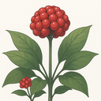

> [!WARNING]
> This project is in early development. Features, stability, and security guarantees are not yet established. Use at your own risk.

<div align="center">



# Ginseng

[](https://github.com/alDuncanson/ginseng/actions/workflows/ci.yml)
[](https://github.com/alDuncanson/ginseng/releases)
[](https://github.com/alDuncanson/ginseng/stargazers)
[](https://github.com/alDuncanson/ginseng/releases)

[](https://nixos.org)
[](https://tauri.app)
[](https://www.rust-lang.org)
[](https://react.dev)
[](https://bun.sh)
[](https://iroh.computer)

*Native peer-to-peer file sharing that restores user agency*

</div>

## Philosophy

Ginseng embodies the conviction that users deserve sovereignty over their data and connections. Built atop [Iroh's](https://iroh.computer) peer-to-peer foundation, it eliminates intermediaries, circumvents surveillance capitalism, and returns computational autonomy to individuals. Your devices communicate directly—encrypted, authenticated, unmediated—transforming powerful hardware into genuine peers rather than subordinate clients.

No accounts. No servers. No gatekeepers. Just cryptographically secure connections between devices you control.

## Quick Start

**Nix Flake** (recommended):
```bash
nix develop                # Enter development shell
nix run .#dev             # Launch development build
nix run .#build           # Create release bundles
```

**Manual Setup**:
```bash
bun install               # Install dependencies  
bun run tauri dev         # Development server
bun run tauri build       # Production build
```

With direnv: `direnv allow` activates the development environment automatically.

## Architecture

- **Frontend**: React 19 + TypeScript + Vite
- **Backend**: Rust + Tauri 2.0 + Iroh networking
- **Build System**: Nix Flakes + Bun + Cargo
- **Platforms**: macOS, Linux, Windows (native bundles)

## Development

CI validates TypeScript compilation, Rust formatting, linting, and test suites. Releases trigger automatically on `v*.*.*` tags, generating platform-specific binaries via GitHub Actions.

The Nix flake provides reproducible development environments with Rust toolchain, Bun runtime, and all system dependencies pre-configured.